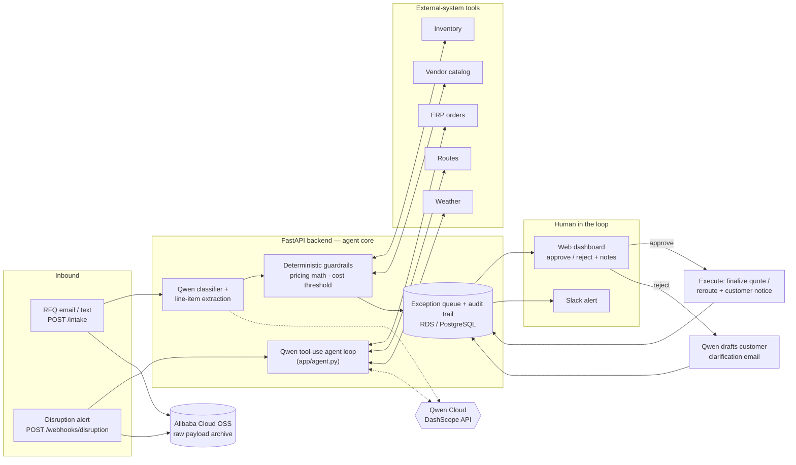

# NexusChain Autopilot

**An autopilot agent for back-office operations, built on Qwen Cloud.** It runs two
real business workflows end-to-end, RFQ quoting and shipment-disruption response.
Every ambiguous or high-stakes case pauses at a human checkpoint before anything gets
quoted, rerouted, or sent to a customer.

> Global AI Hackathon Series with Qwen Cloud, **Track 4: Autopilot Agent**

## What it does

- **RFQ intake.** Takes a messy free-text quote request (for example, "I need 50
  heavy-duty bolts, ship ASAP"), extracts structured line items with Qwen, and prices them against
  inventory and vendor-catalog tools. Any item with a missing or unclear spec is flagged
  for review. When a reviewer rejects a quote, Qwen drafts the clarification email back
  to the customer from the unresolved items and the reviewer's note, so the human
  decision feeds back into agent action.
- **Disruption response.** A Qwen **function-calling agent** investigates each shipment
  alert on its own. It decides which tools to call (ERP orders, current route, alternate
  route, weather) and in what order, then recommends whether to reroute. Every tool call
  lands in an audit trace a reviewer can inspect. A deterministic layer independently
  recomputes the cost delta, and a configurable dollar threshold forces human approval
  regardless of what the model concluded. The model recommends; the backend does the
  arithmetic that money depends on.

In a live run, the agent investigated a Chicago port storm with four tool calls, cited
the 6-day port delay and both affected customers in its reasoning, and recommended
rerouting from ocean to air freight. The $1,200 cost delta still stopped at a human
checkpoint because it exceeded the $200 approval threshold. That is the intended
behavior.

## Architecture



At runtime, a Docker container on **Alibaba Cloud ECS** serves the API, **RDS (PostgreSQL)**
holds the audit store, raw payloads are archived to **OSS**
([`backend/app/oss_client.py`](backend/app/oss_client.py)), and model calls go to
**Qwen via DashScope**.

## Production readiness

- **Fail-safe degradation.** Every Qwen call has a timeout and a retry. Any model
  failure degrades to `human_review` with the error recorded. A model outage cannot
  auto-approve anything or take the API down.
- **Full audit trail.** Every request, autonomous or reviewed, becomes a database record
  with the model's decision, its reasoning, the agent's tool-call trace, the structured
  details, and the action eventually executed.
- **Deterministic guardrails.** Financial figures are recomputed from source data, and a
  dollar threshold binds the agent no matter how confident it is.
- **Pluggable playbooks.** Both workflows share one agent core, one exception queue, and
  one dashboard. Adding a third workflow means adding a `workflows/*.py` module.
- **Tested.** 25 pytest tests cover the pricing math, the guardrail interplay, the agent
  loop protocol (scripted model, real tools), and the full HTTP API including
  approve/reject side effects. Run them with `cd backend && pytest`.

## Quickstart

```bash
cd backend
python -m venv .venv && source .venv/bin/activate
pip install -r requirements.txt
cp .env.example .env   # set DASHSCOPE_API_KEY
uvicorn app.main:app --reload
```

Then exercise it:

```bash
# Ambiguous RFQ -> flagged for human review with Qwen's reasoning
curl -X POST localhost:8000/intake -H "Content-Type: application/json" \
  -d '{"workflow": "rfq", "text": "I need 50 heavy-duty bolts, ship ASAP"}'

# Disruption alert -> agent investigates via tool calls, returns trace + cost delta
curl -X POST localhost:8000/webhooks/disruption -H "Content-Type: application/json" \
  -d '{"shipment_id": "SHIP-7781", "alert_text": "Severe winter storm hitting the Chicago port", "location": "Chicago, IL"}'
```

Open **http://localhost:8000/dashboard** to review pending exceptions and approve or
reject them. Each disruption card includes the agent's full tool-call trace. Approval
executes the real side effect and writes the action log back to the audit trail.

See [`backend/README.md`](backend/README.md) for the full API reference and
[`backend/DEPLOY.md`](backend/DEPLOY.md) for the Alibaba Cloud runbook (ECS + RDS + OSS).

## Repo layout

| Path | What it is |
|---|---|
| `backend/app/agent.py` | Generic Qwen function-calling loop and the disruption agent |
| `backend/app/qwen_client.py` | DashScope client: classification, extraction, reply drafting, all fail-safe |
| `backend/app/workflows/` | The two playbooks (RFQ, disruption), pure business logic |
| `backend/app/tools.py` | External-system adapters (ERP, vendor catalog, routes, weather) |
| `backend/app/oss_client.py` | Alibaba Cloud OSS payload archiving |
| `backend/app/main.py` | API and HITL dashboard routes |
| `backend/tests/` | 25-test suite (workflows, agent loop, API) |

## License

MIT. See [LICENSE](LICENSE).
