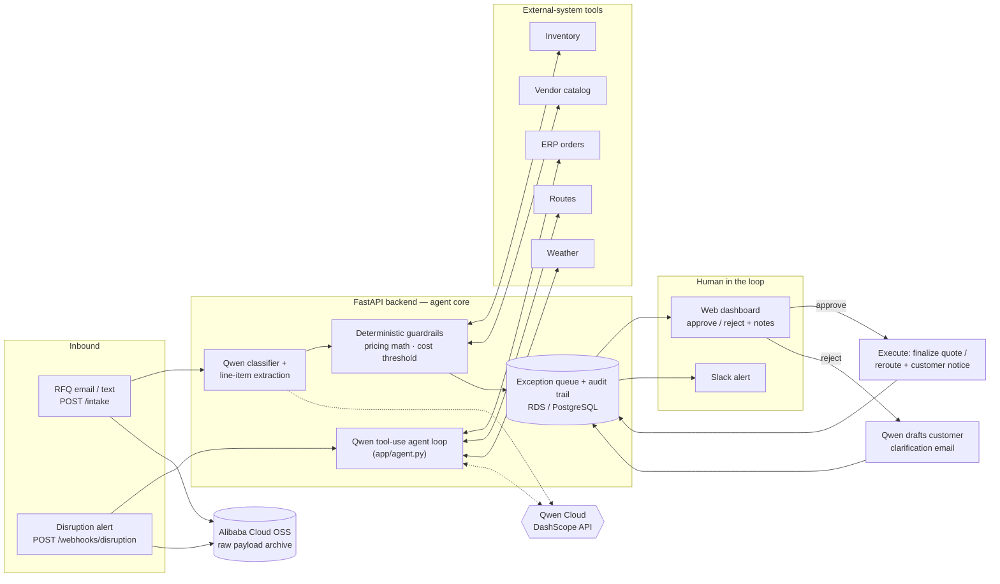

# Ops Autopilot

**An autopilot agent for back-office operations, built on Qwen Cloud.** It automates two
real business workflows end-to-end — RFQ quoting and shipment-disruption response — and
knows when *not* to act alone: every ambiguous or high-stakes case pauses at a
human-in-the-loop checkpoint before anything gets quoted, rerouted, or sent to a customer.

> Global AI Hackathon Series with Qwen Cloud — **Track 4: Autopilot Agent**

## What it does

- **RFQ intake** — parses messy free-text quote requests ("I need 50 heavy-duty bolts,
  ship ASAP"), extracts structured line items with Qwen, prices them against inventory
  and vendor-catalog tools, and flags any item with a missing or ambiguous spec instead
  of guessing. When a reviewer rejects a quote, Qwen drafts the clarification email back
  to the customer from the unresolved items and the reviewer's note — the human decision
  feeds back into agent action.
- **Disruption response** — a Qwen **function-calling agent** investigates each shipment
  alert on its own: it decides which tools to call (ERP orders, current route, alternate
  route, weather) and in what order, then recommends whether to reroute. Every tool call
  is captured in an audit trace a reviewer can inspect. A deterministic layer then
  independently recomputes the cost delta — the model recommends, but it never does the
  arithmetic that money depends on — and a configurable dollar threshold forces human
  approval regardless of what the model concluded.

In a live run, the agent investigated a Chicago port storm with four tool calls, cited
the 6-day port delay and both affected customers in its reasoning, and recommended an
ocean→air reroute — and the $1,200 cost delta still (correctly) stopped at a human
checkpoint because it exceeded the $200 approval threshold.

## Architecture



A styled version lives at [`docs/architecture.html`](docs/architecture.html). Runtime:
Docker container on **Alibaba Cloud ECS**, audit store on **RDS (PostgreSQL)**, raw
payloads archived to **OSS** ([`backend/app/oss_client.py`](backend/app/oss_client.py)),
model calls to **Qwen via DashScope**.

## Why it's production-shaped, not a toy

- **Fail-safe degradation** — every Qwen call has a timeout and retry, and any model
  failure degrades to `human_review` with the error recorded, never to a silent
  auto-approval or a 500.
- **Full audit trail** — every request (autonomous or not) becomes a database record with
  the model's decision, its reasoning, the agent's tool-call trace, the structured
  details, and eventually the action actually executed.
- **Guardrails over trust** — financial figures are recomputed deterministically from
  source data; a dollar threshold binds the agent no matter how confident it is.
- **Pluggable playbooks** — both workflows share one agent core, one exception queue, and
  one dashboard; a third workflow is a new `workflows/*.py` module, not a new system.
- **Tested** — 25 pytest tests cover the pricing math, the guardrail interplay, the
  agent loop protocol (scripted model, real tools), and the full HTTP API including
  approve/reject side effects: `cd backend && pytest`.

## Quickstart

```bash
cd backend
python -m venv .venv && source .venv/bin/activate
pip install -r requirements.txt
cp .env.example .env   # set DASHSCOPE_API_KEY
uvicorn app.main:app --reload
```

Then exercise it:

```bash
# Ambiguous RFQ -> flagged for human review with Qwen's reasoning
curl -X POST localhost:8000/intake -H "Content-Type: application/json" \
  -d '{"workflow": "rfq", "text": "I need 50 heavy-duty bolts, ship ASAP"}'

# Disruption alert -> agent investigates via tool calls, returns trace + cost delta
curl -X POST localhost:8000/webhooks/disruption -H "Content-Type: application/json" \
  -d '{"shipment_id": "SHIP-7781", "alert_text": "Severe winter storm hitting the Chicago port", "location": "Chicago, IL"}'
```

Open **http://localhost:8000/dashboard** to review pending exceptions — each disruption
card includes the agent's full tool-call trace — and approve/reject them; approval
executes the real side effect and writes the action log back to the audit trail.

See [`backend/README.md`](backend/README.md) for the full API reference and
[`backend/DEPLOY.md`](backend/DEPLOY.md) for the Alibaba Cloud runbook (ECS + RDS + OSS).

## Repo layout

| Path | What it is |
|---|---|
| `backend/app/agent.py` | Generic Qwen function-calling loop + the disruption agent |
| `backend/app/qwen_client.py` | DashScope client: classification, extraction, reply drafting — all fail-safe |
| `backend/app/workflows/` | The two playbooks (RFQ, disruption) — pure business logic |
| `backend/app/tools.py` | External-system adapters (ERP, vendor catalog, routes, weather) |
| `backend/app/oss_client.py` | Alibaba Cloud OSS payload archiving |
| `backend/app/main.py` | API + HITL dashboard routes |
| `backend/tests/` | 25-test suite (workflows, agent loop, API) |
| `docs/` | Architecture diagram, demo script, submission text |

## License

MIT — see [LICENSE](LICENSE).
